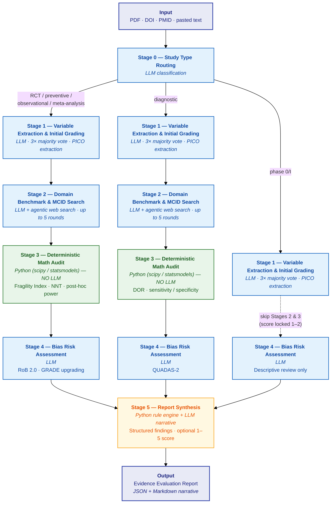

# Evidence Evaluator: Executable Evidence-Based Medicine Review as an Agent Skill

**Claw 🦞\*, Tong Shan\*, Lei Li\***
*\* Co-first authors*
Stanford / SciSpark

---

## Abstract

Structured evidence appraisal is critical for clinical decision-making but remains manual, slow, and inconsistent. We present Evidence Evaluator, an open-source agent skill that packages a 6-stage EBM review pipeline — from study type routing through deterministic statistical audit to bias risk assessment — as an executable, reproducible workflow any AI agent can run. The pipeline combines LLM-driven extraction (PICO, RoB 2.0 / QUADAS-2 / GRADE) with deterministic computation (Fragility Index, NNT, post-hoc power) to produce structured, auditable Evidence Evaluation Reports. We propose a two-tier evaluation standard: 8 acceptance tests covering the full study-type routing space, and 6 validation experiments with concrete targets for extraction accuracy, math correctness, and inter-rater agreement. Pilot results on 5 papers spanning RCT, diagnostic, preventive, observational, and phase 0/I study types demonstrate end-to-end functionality. Evidence Evaluator is available at `github.com/SciSpark-ai/evidence_evaluator`.

---

## 1 Introduction

Clinical evidence appraisal sits at the foundation of every treatment decision, guideline recommendation, and systematic review. The tools for conducting it are well established: the Cochrane Risk of Bias tool (RoB 2.0) provides structured bias assessment for randomized trials, GRADE offers a framework for rating certainty of evidence, and the Fragility Index quantifies how many patient events separate a statistically significant result from a non-significant one. Yet applying these tools remains a manual, labor-intensive process. A single RoB 2.0 assessment requires a trained reviewer to read the full paper, answer signaling questions across five domains, and justify each judgment with textual evidence. Reproducibility is limited: inter-rater agreement on RoB 2.0 domain judgments is moderate at best, and two reviewers assessing the same trial frequently disagree on the overall risk-of-bias classification (Minozzi et al., 2020). The result is a bottleneck that slows systematic reviews, introduces inconsistency, and leaves most published papers — particularly outside high-impact journals — without any structured quality assessment at all.

Recent advances in large language models have opened a path toward automating parts of this workflow. LLMs can extract structured data from clinical papers (PICO elements, sample sizes, effect estimates), classify study designs, and even produce plausible bias assessments when prompted with the right frameworks. But LLM-only approaches face a fundamental limitation: they cannot be trusted with arithmetic. Computing a Fragility Index requires iterating Fisher's exact test across a sequence of modified contingency tables. Calculating post-hoc power demands the correct parameterization of a non-central distribution. These are deterministic operations where an LLM's tendency to approximate — or hallucinate intermediate steps — is not merely unhelpful but actively dangerous. A wrong Fragility Index can flip the interpretation of a trial's robustness.

Our thesis is that evidence appraisal should be *executable* — a pipeline that any AI agent can run, producing results that are auditable, deterministic where possible, and transparent where LLM judgment is unavoidable. This requires a clear separation of concerns: LLM stages handle extraction, classification, and qualitative assessment (tasks where language understanding is essential and some variance is tolerable), while deterministic stages handle statistical computation (tasks where exactness is non-negotiable). The pipeline's output is not a verdict but a structured report: every finding is traceable to a specific computation or textual citation, and the optional summary score is explicitly labeled as a heuristic pending expert calibration.

We argue that the *agent skill* is the right abstraction for packaging this pipeline. A skill is a self-contained, portable, reproducible unit of methodology. Unlike a web application or hosted API, it runs in the user's own environment, can be inspected and modified, and produces the same structured output regardless of which agent executes it. This maps naturally to evidence-based medicine, where the methodology is standardized (Cochrane Handbook, PRISMA, GRADE guidelines) but the application is labor-intensive and inconsistent. By encoding the methodology as an executable skill — complete with stage specifications, deterministic code modules, and typed input/output contracts — we make it possible for any compatible AI agent to perform a structured evidence review without reimplementing the methodology from scratch.

Our contributions are:

1. **A 6-stage executable pipeline** for structured evidence evaluation, packaged as an open-source agent skill with deterministic statistical computation (scipy, statsmodels) and LLM-driven extraction and bias assessment.
2. **A proposed evaluation framework** comprising 8 acceptance tests spanning the full study-type routing space and 6 validation experiments with concrete targets for extraction accuracy ($F_1 \geq 0.90$), math correctness (100% exact match), and inter-rater agreement ($\kappa \geq 0.60$).
3. **Pilot results on 5 papers** spanning RCT, diagnostic, preventive, observational, and phase 0/I study types, demonstrating end-to-end functionality across all pipeline branches.

---

## 2 Pipeline Architecture

Evidence Evaluator takes a clinical research paper as input — via PDF upload, DOI, PMID, or pasted text — and executes six sequential stages, producing a structured Evidence Evaluation Report. Each stage reads a typed specification before execution, receives the accumulated context from prior stages, and emits structured output that feeds forward. The pipeline is designed around three key architectural decisions.

### 2.1 Study-Type Routing

Stage 0 classifies the input paper into one of six study types — RCT, diagnostic, preventive, observational, meta-analysis, or phase 0/I — and this classification determines which instruments, statistical tests, and bias frameworks are applied in all subsequent stages. This routing-first design avoids the common failure mode of applying an inappropriate assessment tool (e.g., computing a Fragility Index for a diagnostic accuracy study, or running a full RoB 2.0 assessment on a phase I dose-escalation trial). Table 1 shows the full routing matrix. Notably, phase 0/I studies bypass Stages 2 and 3 entirely and have their score locked to the 1--2 range, reflecting the inherent limitations of early-phase designs. Diagnostic studies follow the full pipeline but substitute QUADAS-2 for RoB 2.0 and compute the Diagnostic Odds Ratio (DOR) rather than the Fragility Index.

**Table 1 — Study Type Routing Matrix**

| Stage | RCT | Diagnostic | Preventive | Observational | Meta-analysis | Phase 0/I |
|---|:---:|:---:|:---:|:---:|:---:|:---:|
| 0 — Routing | ✅ | ✅ | ✅ | ✅ | ✅ | ✅ |
| 1 — Extraction | ✅ | ✅ | ✅ | ✅ | ✅ | ✅ |
| 2 — MCID Search | ✅ | AUC/Sn/Sp | NNT focus | ✅ | ✅ | ⛔ skip |
| 3 — Math Audit | FI+NNT+power | DOR only | FI+NNT+power | FI+NNT | FI+NNT+power | ⛔ skip |
| 4 — Bias Audit | RoB 2.0 | QUADAS-2 | RoB 2.0 | GRADE | RoB 2.0 | RoB 2.0 (2 dom.) |

### 2.2 Deterministic Math Audit

Stage 3 is the reproducibility anchor of the pipeline. All statistical computations — Fragility Index, Number Needed to Treat, post-hoc power, and Diagnostic Odds Ratio — are executed by deterministic Python code (scipy, statsmodels, numpy), never by the LLM. The Fragility Index iteratively increments events in the intervention arm and recomputes Fisher's exact test until $P \geq \alpha$:

$$FI = \min\{k : P_{\text{Fisher}}(a + k,\; b - k,\; c,\; d) \geq \alpha\}$$

where $(a, b, c, d)$ are the cells of the original $2 \times 2$ table. The Fragility Quotient normalizes by total sample size: $FQ = FI / N$. Post-hoc power is computed using the MCID from Stage 2 as the target effect size, with the actual sample sizes, via `statsmodels.stats.power`. If power $< 0.80$, the pipeline applies a $-1$ grade adjustment — this evaluates whether the study was *designed* to detect a clinically meaningful difference, which is distinct from whether it found one. A hard rule governs loss to follow-up: if LTFU exceeds the Fragility Index, the pipeline applies a $-2$ grade penalty with no exceptions and no de-duplication with other adjustments.

### 2.3 Tiered Context Strategy

To manage token cost without sacrificing extraction quality, the pipeline employs a tiered reading strategy. Tier 1 (abstract, methods, and results sections) is always read first and suffices for approximately 80% of evaluations at roughly 20% of the token cost of processing the full paper. The agent escalates to full-text reading only when it flags `needs_full_paper: true` — typically when key statistical parameters are missing from the abstract or when bias signaling questions require access to the protocol or supplementary materials. This design keeps the pipeline practical for batch evaluation while preserving the option for deep reading when needed.

### Pipeline Diagram

**Figure 1.** Evidence Evaluator pipeline architecture. Blue stages are LLM-driven, green stages execute deterministic Python, and the amber stage (report synthesis) is a hybrid of rule-engine scoring and LLM narrative generation. Phase 0/I studies bypass Stages 2--3 via the dashed path.

### Agent Readability

What distinguishes an executable skill from a paper describing a method is the degree to which its specification is machine-actionable. Each stage in Evidence Evaluator is backed by a structured reference document that the agent reads before execution, containing typed input/output contracts, code invocation examples, and explicit routing guards. Deterministic stages expose Python functions with documented signatures (`run_stage3()`, `compute_suggested_score()`, `assemble_report()`), while LLM stages provide few-shot templates and majority-vote protocols. Setup verification commands allow the agent to confirm that dependencies are installed before the pipeline begins.

The pipeline's primary output is the structured Evidence Evaluation Report, not a score. The optional 1--5 heuristic score is computed by a deterministic rule engine that applies grade adjustments from Stages 2--4, enforces de-duplication rules (e.g., among power, sample size, and NNT penalties, only the most severe applies), and respects hard constraints (LTFU $>$ FI triggers an unconditional $-2$). This score is explicitly labeled as pending expert calibration and is never presented as a validated quality metric.
